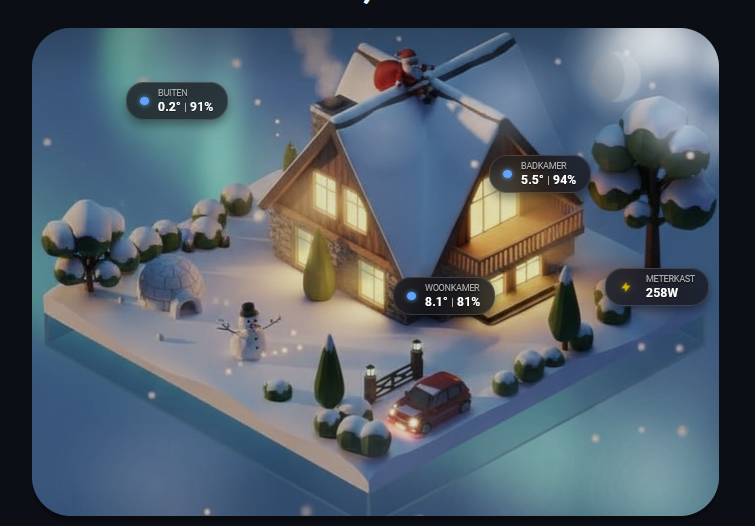

# 🏠 House Card - Multi-Purpose Visualization



A **multi-purpose visualization card** for Home Assistant that transforms your dashboard into an immersive, dynamic display. Overlay sensor data, weather animations, and interactive controls on any custom background image — perfect for house floorplans, isometric buildings, garden layouts, or any visual representation of your smart home.

## ✨ What Makes This Card Special

This isn't just a sensor display — it's a **living visualization** that responds to real-world conditions:

| Feature | Description |
|---------|-------------|
| 🖼️ **Any Background** | Use your own images: house renders, floorplans, photos, pixel art |
| ⛈️ **Weather Animations** | Rain, snow, fog, lightning, clouds — all animated on canvas |
| ☀️ **Sun & Moon** | Realistic celestial bodies with accurate phases and animated glow |
| � **Sky Gradients** | Dynamic sunrise/sunset colors that transition smoothly throughout the day |
| 🌠 **Atmospheric Effects** | Shooting stars, seasonal particles (autumn leaves, cherry blossoms) |
| 📊 **Sensor Badges** | Temperature, humidity, CO2, power — positioned anywhere |
| 💡 **Interactive Lights** | Click windows to toggle lights with realistic glow effects |
| 🔗 **Navigation Hotspots** | Clickable areas to navigate between HA views |

## Features

- ⛈️ **Weather Animations** - Rain, snow, fog, lightning, clouds, and stars
- ☀️ **Daytime Sun** - Realistic sun with subtle atmospheric glow and light beams
- 🌙 **Moon Phases** - Realistic moon rendering with accurate illumination and animated glow
- 🌅 **Sky Gradients** - Beautiful sunrise/sunset color transitions based on real sun elevation
- 🌠 **Shooting Stars** - Occasional shooting stars streak across the night sky
- 🍂 **Seasonal Particles** - Autumn leaves and spring cherry blossom petals
- 📊 **Sensor Badges** - Display temperature, humidity, CO2, power consumption
- 💡 **Window Lights** - Link light entities to windows (glow when on, dark when off)
- 🔗 **Navigation Links** - Clickable hotspots to navigate to other HA views
- 🎮 **Gaming/Party Mode** - Ambient lighting effects
- 🖼️ **Seasonal Images** - Automatic day/night and seasonal background changes
- 🎄 **Christmas Mode** - Special images from Dec 14 - Jan 14

## Required Integrations

This card works with standard Home Assistant integrations:

### Core (Required)
- 🌤️ [Weather](https://www.home-assistant.io/integrations/weather/) - For weather animations and conditions
- ☀️ [Sun](https://www.home-assistant.io/integrations/sun/) - For day/night detection and sun rendering (built-in)
- 📅 [Season](https://www.home-assistant.io/integrations/season/) - For seasonal backgrounds and particles (built-in)

### Optional (Enhanced Features)
- 🌙 [Moon](https://www.home-assistant.io/integrations/moon/) - For accurate moon phase names (illumination calculated automatically)
- ☁️ [OpenWeatherMap](https://www.home-assistant.io/integrations/openweathermap/) - For cloud coverage data
- 💨 Wind Speed/Direction sensors - For realistic animation effects

## Support

If you enjoy this card and want to support its development, you can buy me a coffee!

[](https://buymeacoffee.com/timgerr)

## Installation

### HACS (Recommended)
1. Open HACS in Home Assistant
2. Click the three dots menu (⋮) → **Custom repositories**
3. Add the repository URL:
   ```
   https://github.com/MLNGE/house-card
   ```
4. Select category: **Lovelace**
5. Click **Add** → Find "House Card" → Click **Download**
6. Restart Home Assistant
7. Add the resource to your Lovelace configuration (HACS usually does this automatically)

### Manual
1. Download `house-card.js` from the [latest release](https://github.com/MLNGE/house-card/releases)
2. Copy to `/config/www/community/house-card/`
3. Add the resource in your Lovelace configuration:
   ```yaml
   resources:
     - url: /local/community/house-card/house-card.js
       type: module
   ```

## Configuration

```yaml
type: custom:house-card
title: "My Residence"  # Optional title (visual only)
language: "en"

# --- Global Visual Adjustments ---
scale: 1.0            # Scale factor for badges (0.8 = smaller, 1.2 = larger)
badge_opacity: 0.75   # Badge transparency (0.0 = fully transparent, 1.0 = fully opaque)
background_zoom: 1.0  # Zoom factor for background image (0.8 = zoom out, 1.2 = zoom in)
image_x_offset: 0     # Horizontal shift for background image in pixels (Negative = LEFT, Positive = RIGHT)
image_y_offset: 0     # Vertical shift for background image in pixels (Negative = UP, Positive = DOWN)

# --- Image Path ---
image_path: "/local/community/house-card/images/"

# --- Image Mapping Logic ---
# Logic: Checks Season → Time of Day → Weather
# Example: If true, looks for "winter_fog_day.png". If false/missing, falls back to "winter_day.png".
img_winter_day_fog: true    
img_winter_night_fog: false 
# Repeat for other seasons (summer, autumn, spring) and weather types (rainy, snowy, lightning) if desired.

# Note: Christmas Mode is active Dec 14 - Jan 14.
# Ensure you have 'winter_xmas_day.png' and 'winter_xmas_night.png' in your folder.

# --- Testing ---
# Force a specific weather state to test animations (fog, lightning, snowy, rainy, pouring)
# test_weather_state: fog 
# Force a specific season to test seasonal particles and background (spring, summer, autumn, winter)
# test_season_state: autumn
# Force day or night mode to test backgrounds and night animations (day, night)
# test_time_of_day: night

# --- Core Entities (REQUIRED) ---
weather_entity: weather.forecast_home
season_entity: sensor.season
sun_entity: sun.sun
# Note: The sun.sun entity provides elevation automatically via its 'elevation' attribute.
# If you have a separate sun elevation sensor, specify it here:
sun_elevation_entity: sensor.sun_solar_elevation  # Optional: Use if you have a separate elevation sensor
# Some users may need to enable the elevation attribute in the Sun integration settings
cloud_coverage_entity: sensor.openweathermap_cloud_coverage  # Optional (0-100%)
party_mode_entity: input_boolean.gaming_mode  # Optional: Toggles "Gaming Ambient" light effects

# --- Moon Configuration ---
# Requires the Moon integration: https://www.home-assistant.io/integrations/moon/
moon_entity: sensor.moon_phase   # HA moon sensor (falls back to calculated if not set)
moon_position_x: 85              # Horizontal position % (default: 85)
moon_position_y: 15              # Vertical position % (default: 15)
moon_size: 1.0                   # Scale factor (0.5 = smaller, 1.5 = larger)
moon_glow: true                  # Enable animated glow effect (default: true)

# --- Sun Configuration ---
sun_position_x: 15               # Horizontal position % (default: 15)
sun_position_y: 20               # Vertical position % (default: 20)
sun_size: 1.0                    # Scale factor (0.5 = smaller, 1.5 = larger)
sun_glow: true                   # Enable animated glow effect (default: true)
sun_rays: true                   # Enable rotating sun rays (default: true)

# --- Sky Gradient Configuration ---
sky_gradient: true               # Enable dynamic sky color transitions (default: true)
sky_gradient_intensity: 0.8      # Gradient opacity (0.0-1.0, default: 0.8)
# Note: Gradient appears as subtle glow at top/bottom edges, center remains clear
test_elevation: 0                # Override sun elevation for testing (-90 to 90 degrees)

# --- Shooting Stars ---
shooting_stars: true             # Enable shooting stars at night (default: true)
shooting_star_frequency: 0.002   # Spawn frequency (0.001 = rare, 0.01 = frequent)

# --- Seasonal Particles ---
# Autumn: falling leaves | Spring: cherry blossom petals
seasonal_particles: true         # Enable seasonal particles (default: true)
seasonal_particle_density: 1.0   # Particle density (0.5 = fewer, 2.0 = more)

# --- Wind Entities (For Animation Speed/Direction) ---
wind_speed_entity: sensor.wind_speed      # Wind Speed (km/h)
wind_direction_entity: sensor.wind_bearing  # Wind Bearing (degrees)

# --- Rooms / Badges Configuration ---
# Define sensors to display as badges over the house image.
# x: Horizontal position % (0 = left, 100 = right)
# y: Vertical position % (0 = top, 100 = bottom)
# unit: Custom unit string (default: "°"). Set to "W" for Power (Yellow Spark icon).
# decimals: Number of decimal places (default: 1). Set to 0 for integers.
# humidity_entity: Optional second value to display next to main value (e.g. "21° | 45%")
# weight: 1 = Include in calculation, 0 = Exclude
rooms:
  - name: "Living Room"
    entity: sensor.living_room_temperature
    humidity_entity: sensor.living_room_humidity  # Optional: Displays humidity next to temp
    x: 50
    y: 70
    weight: 1

  - name: "Bedroom"
    entity: sensor.bedroom_temperature
    x: 20
    y: 30
    weight: 1

  - name: "Total Power"
    entity: sensor.power_consumption
    unit: "W"        # Shows Yellow Spark icon instead of colored temp dot
    decimals: 0      # Shows "2050 W" instead of "2050.0 W"
    x: 80
    y: 80
    weight: 0

# --- Window Lights Configuration ---
# Link light entities to specific window regions on the house image.
# When the light is ON, the window glows. When OFF, the window appears dark.
# Clicking a window will toggle the light entity.
window_glow_intensity: 1.0   # Glow brightness (0.5 = dimmer, 1.5 = brighter)
window_glow_size: 1.0        # Glow spread size (0.5 = tighter, 2.0 = larger spread)
window_glow_color: "#FFA64D" # Default glow color for all windows (warm orange)
# Per-window options:
# color: Glow color when light is on (hex format, default: "#FFA64D" warm orange)
# skew_x/skew_y: Skew angles in degrees to match isometric perspective (e.g., skew_x: -30 for left-facing windows)
window_lights:
  - entity: light.living_room_lamp
    x: 25          # Position of window center (percentage)
    y: 60
    width: 8       # Size of the glow area
    height: 10
    skew_x: -30    # Skew angle for isometric perspective (degrees)
    skew_y: 0      # Vertical skew (degrees)
    color: "#FFA64D"  # Warm orange glow (optional)

  - entity: light.bedroom
    x: 70
    y: 45
    width: 6
    height: 8
    skew_x: 30     # Positive skew for right-facing windows
    color: "#FFFACD"  # Soft warm white

# --- Navigation Links Configuration ---
# Create invisible clickable hotspots that navigate to different HA views/tabs.
# Clicking the hotspot navigates to the specified path.
nav_links:
  - path: /lovelace/garage   # The HA view path to navigate to
    x: 80                     # Position of hotspot center (percentage)
    y: 70
    width: 15                 # Size of clickable area
    height: 20
    icon: "mdi:garage"        # Optional icon
    label: "Garage"           # Optional label

  - path: /lovelace/car
    x: 85
    y: 85
    width: 10
    height: 12

# --- Decorations (Images/Pets) ---
# Add image overlays for pets, garden gnomes, vehicles, or any decorative elements.
# Images should be PNG with transparency for best results.
decorations:
  - image: "/local/images/dog.png"   # Path to your image
    x: 75                             # Position (percentage)
    y: 85
    width: 8                          # Width (percentage)
    # height: auto                    # Height (auto = maintain aspect ratio)
    # animate: true                   # Animation: true/bounce, sway, or wag
    # flip_x: false                   # Mirror the image horizontally
    # opacity: 1.0                    # Transparency (0.0 - 1.0)

# --- Debug Modes ---
# Enable these to see colored outlines for positioning overlays:
# window_lights_debug: true   # Red dashed outlines for window lights
# nav_links_debug: true       # Green dashed outlines for navigation links
# decorations_debug: true     # Magenta dashed outlines for decorations

# --- Testing Sky Gradients ---
# Override sun elevation to preview different times of day:
# test_elevation: -20   # Deep night
# test_elevation: -6    # Civil twilight (deep blue)
# test_elevation: -2    # Pre-dawn/post-dusk (blue-purple)
# test_elevation: 0     # Sunrise/Sunset horizon (orange begins)
# test_elevation: 2     # Golden hour (intense orange/pink)
# test_elevation: 6     # Late golden hour (transitioning to day)
# test_elevation: 30    # Midday (clear blue sky)
```

## Position Reference

All positions use **percentages**:
- `x: 0` = left edge, `x: 100` = right edge
- `y: 0` = top edge, `y: 100` = bottom edge

Use debug modes to help with positioning overlays.

## Required Images

Place images in your configured `image_path`. Naming convention:
```
{season}_{timeofday}.png
{season}_{weather}_{timeofday}.png
winter_xmas_{timeofday}.png
```

Examples:
- `summer_day.png`
- `winter_night.png`
- `autumn_rainy_day.png`
- `winter_xmas_night.png`

## License

MIT

---

<p align="center">
  <i>Transform your Home Assistant dashboard into a living visualization of your smart home.</i>
</p>
